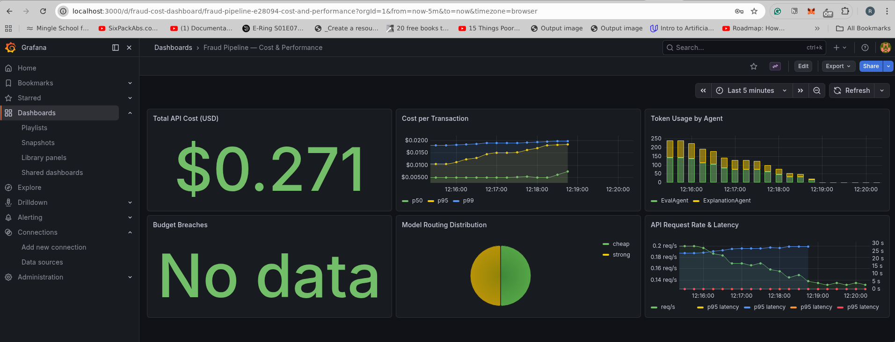

# fraud-explanation-eval

> XGBoost fraud detection + SHAP-grounded LLM explanation evaluation framework.
> **The evaluation is the product. The detector is the substrate.**

## Architecture

```
┌─────────────────────────────────────────────────────────────────────┐
│                     LangGraph Orchestrator                          │
│                  (src/orchestrator/graph.py)                         │
│                                                                     │
│  ┌──────────────────┐                                               │
│  │  FraudTransaction │  IEEE-CIS fields: TransactionAmt, ProductCD, │
│  │  (input)          │  card4, card6, DeviceInfo, email domains      │
│  └────────┬─────────┘                                               │
│           │                                                         │
│           ▼                                                         │
│  ┌──────────────────────────────────────┐                           │
│  │  sanitize_external_text()            │  src/security/sanitizer.py│
│  │  ├─ 10 regex injection patterns      │                           │
│  │  ├─ DeviceInfo, P_emaildomain,       │                           │
│  │  │  R_emaildomain                    │                           │
│  │  └─ Raises InjectionDetectedError    │                           │
│  └────────┬─────────────────────────────┘                           │
│           │ clean                   │ injection detected             │
│           ▼                         ▼                               │
│  ┌────────────────────┐   ┌────────────────────┐                   │
│  │  DetectorModel      │   │  handle_error       │                   │
│  │  (XGBoost + SHAP)   │   │  ├─ error_stage     │                   │
│  │  src/models/         │   │  ├─ error message   │                   │
│  │  detector.py         │   │  └─ completed=True  │                   │
│  └────────┬────────────┘   │  (degraded output)  │                   │
│           │                └────────────────────┘                   │
│           ▼                                                         │
│  ┌────────────────────────────────────────┐                         │
│  │  FraudDetectionResult                  │                         │
│  │  ├─ fraud_probability: float (0–1)     │                         │
│  │  ├─ is_fraud_predicted: bool           │                         │
│  │  ├─ confidence_tier: high|medium|low   │                         │
│  │  └─ top_shap_features: list[SHAP] (5) │                         │
│  └────────┬───────────────────────────────┘                         │
│           │                                                         │
│           ▼                                                         │
│  ┌──────────────────────────────────────────┐                       │
│  │  ExplanationAgent (LiteLLM, cheap tier)  │                       │
│  │  src/agents/explanation_agent.py          │                       │
│  │  ├─ analyst: cites SHAP values + prob    │                       │
│  │  └─ customer: plain language, no prob    │                       │
│  └────────┬─────────────────────────────────┘                       │
│           │                                                         │
│           ▼                                                         │
│  ┌────────────────────────────────────────────────────┐             │
│  │  ExplanationResult                                  │             │
│  │  ├─ explanation_text (≤300 words)                   │             │
│  │  ├─ cited_features ⊆ top_shap_features              │             │
│  │  ├─ hallucinated_features (INVARIANT: always [])    │             │
│  │  ├─ token_cost_usd (INVARIANT: > 0.0)              │             │
│  │  └─ uncertainty_disclosure (if confidence_tier=low) │             │
│  └────────┬───────────────────────────────────────────┘             │
│           │                                                         │
│           ▼                                                         │
│  ┌──────────────────────────────────────────┐                       │
│  │  EvalAgent (LiteLLM, strong tier)        │                       │
│  │  src/agents/eval_agent.py                 │                       │
│  │  LLM-as-judge: scores against rubric     │                       │
│  └────────┬─────────────────────────────────┘                       │
│           │                                                         │
│           ▼                                                         │
│  ┌────────────────────────────────────────────────────┐             │
│  │  ExplanationEvalResult                              │             │
│  │  ├─ grounding_score      (SHAP traceability)       │             │
│  │  ├─ clarity_score        (audience clarity)         │             │
│  │  ├─ completeness_score   (signal coverage)          │             │
│  │  ├─ audience_appropriateness_score                  │             │
│  │  ├─ overall_score        (weighted average)         │             │
│  │  └─ passed               (threshold: 0.70)         │             │
│  └────────────────────────────────────────────────────┘             │
└─────────────────────────────────────────────────────────────────────┘
```

### Data Flow Summary

```
FraudTransaction → sanitize → DetectorModel → ExplanationAgent → EvalAgent
                                    │                │                │
                                    ▼                ▼                ▼
                          FraudDetectionResult  ExplanationResult  ExplanationEvalResult
```

Any node failure routes to `handle_error` → pipeline returns a **degraded result**
(completed=True, error recorded) rather than crashing.

## Quick Start

```bash
cp .env.example .env   # fill in API keys
poetry install
make test              # full test suite
make status
```

## Build Phases

| Phase | Deliverable | Status |
|-------|-------------|--------|
| 0 | Scaffold, schemas, specs, golden scenarios | ✅ Complete |
| 1 | Data pipeline (IEEE-CIS ingestion + feature engineering) | ✅ Complete |
| 2 | XGBoost detector + SHAP extractor | ✅ Complete |
| 3 | Explanation agent (analyst + customer modes) | ✅ Complete |
| 4 | Evaluation framework (LLM-as-judge + golden scenarios) | ✅ Complete |
| 5 | Orchestrator + LangGraph state machine | ✅ Complete |
| 6 | FastAPI + cost dashboard + observability | ✅ Complete |
| 7 | Hardening (adversarial tests, security checklist) | ✅ Complete |

## What Makes This Different

- **Hallucination is structurally prevented**: The `hallucinated_features` Pydantic
  validator raises `ExplanationHallucinationError` if the LLM cites any feature
  not in the SHAP top-5 input. No prompt alone — schema enforcement.
- **Cost tracking is mandatory**: `token_cost_usd=0.0` is rejected at the schema
  level. Every LLM call must provide real token counts.
- **Two audiences, one schema**: `target_audience: Literal["analyst", "customer"]`
  drives prompt selection. Customer mode strips fraud probability at the schema level.
- **Golden scenarios from day 0**: 10 evaluation scenarios defined before any
  implementation begins. They gate every phase.
- **Injection prevention**: All external text fields are sanitized through 10 regex
  patterns before entering LLM context. Detected injections produce graceful
  pipeline degradation, not crashes.

## Results

### Cost Monitoring Dashboard



*Live cost monitoring dashboard — 6 panels showing total API cost,
cost per transaction (p50/p95/p99), token usage by agent, model routing
distribution, and API request rate & latency*

### Results Summary

| Metric | Value |
|--------|-------|
| Total tests | 295 passing |
| Coverage | 97% |
| Adversarial tests | 40 (injection + data leakage) |
| Golden scenarios | 6/7 pass (GS-009 fails by design — proves evaluator rejects bad explanations) |
| Avg cost per transaction | $0.013 |
| Budget breaches | 0 |
| Model AUC | 0.78 (50k sample, IEEE-CIS) |
| API auth | 401 on unauthenticated, 200 on authenticated |

## Running the Pipeline

```bash
make train SAMPLE=50000
make explain TX=TX_TEST_001
make cost-report
```

## Tech Stack

- **Detection**: XGBoost + SHAP
- **Explanation**: LiteLLM (Haiku for generation, Sonnet for evaluation)
- **Structured output**: Instructor + Pydantic v2
- **Orchestration**: LangGraph
- **API**: FastAPI with SSE streaming
- **Observability**: Prometheus + Grafana
- **Testing**: Pytest + VCR.py (pytest-recording)
- **Deployment**: Docker Compose

## Security

See [docs/SECURITY.md](docs/SECURITY.md) for the full threat model, mitigations,
and test references.
